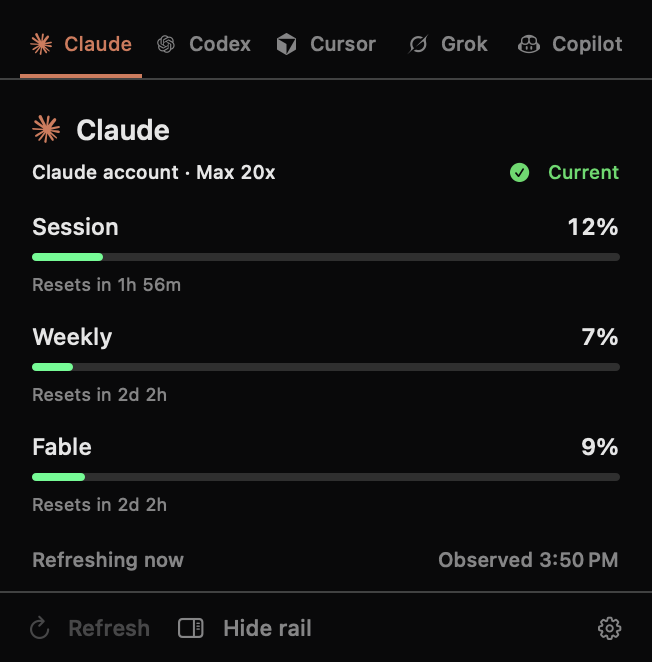
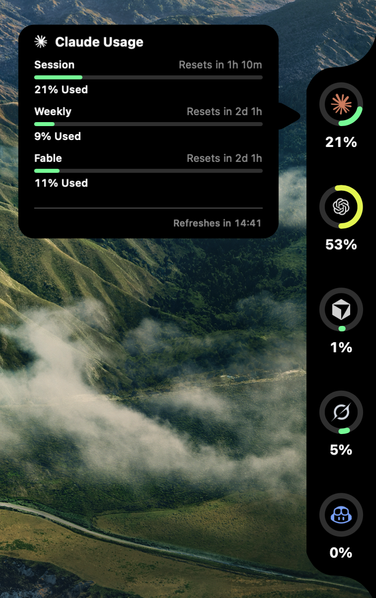

<div align="center">


# Pace

**Know how much of your AI usage is left, without opening five dashboards.**

[](https://github.com/amitray007/pace/actions/workflows/ci.yml)
[](LICENSE)
[](https://www.apple.com/macos/)
[](https://swift.org)

</div>

Pace is a macOS menu-bar app that reads your session, weekly, and credit limits from Claude, Codex,
Cursor, Grok, and GitHub Copilot, and shows them in one place. It reads the same credentials those
tools already store on your Mac. Nothing leaves your machine except the requests to each provider.

<div align="center">

</div>

## Install

```sh
brew install --cask amitray007/tap/pace
```

Pace is not notarized by Apple, so the cask strips the quarantine flag and re-signs the bundle
locally on install. See [Unsigned builds](#unsigned-builds).

To build from source instead, see [Development](#development).

## What it shows

Each provider reports its own quota windows, and Pace shows the ones it actually returns rather
than assuming every account has the same shape. A Claude account might report a 5-hour session
alongside a weekly limit; a Cursor account reports included and API usage separately.

Colour tracks how much is used, not which provider it belongs to: green below 50%, yellow to 90%,
red above. So an exhausted quota looks urgent no matter whose it is.

**Menu bar.** The status item can show up to two readings you pick — a provider and a specific
quota each. It follows the menu bar's own appearance like the system's items do, and updates on
every refresh.

**Edge rail.** An optional ambient rail on the screen edge, with a ring per provider. It stays
click-through when collapsed, so it never blocks scrollbars, drags, or trackpad momentum.

<div align="center">

</div>

## Providers

| Provider | Reads credentials from | Quota windows |
| --- | --- | --- |
| Claude | `Claude Code-credentials` in your keychain, or a Claude Code profile | Session, weekly, per-model |
| Codex | The Codex app server, using `CODEX_HOME` | Rolling 5-hour and 7-day limits |
| Cursor | `cursor-access-token` in your keychain | Included usage, API usage, per-model |
| Grok | `auth.json` in your Grok profile directory | Weekly limit |
| GitHub Copilot | The `gh` CLI you already have authenticated | Credits |

Pace never asks for a password and never stores one. It reads the credential each provider's own
tool has already saved, and macOS asks for your approval the first time it does. It does not read
browser cookies and does not copy tokens between providers.

Two of these use endpoints the provider has not documented publicly: GitHub's
`copilot_internal/user` and Cursor's `DashboardService`. They can change or stop working without
notice. Pace shows the failure rather than a stale number when they do.

## Honest data

The rule Pace follows: never show a number a provider did not return.

- A quota with no reading shows `--`, not `0%`.
- A missing reset time reads "Reset unavailable" rather than a guess.
- Stale data stays visible and is labelled, instead of the panel emptying out.
- Usage is never averaged across accounts. You pick an account, or Pace shows the most urgent quota.

## Settings

- **Launch at login**, through macOS Service Management. Pace never changes this without you
  clicking it.
- **Hide account addresses**, which replaces your email with the provider name everywhere. For
  screenshots and screen sharing.
- **Menu-bar readings**, up to two, each a provider plus a quota.
- **Edge rail** placement, size, screen, and how it activates.
- **Notifications** for usage thresholds, resets, and stale data. Off by default.

## Privacy

Usage snapshots and preferences are stored in `~/Library/Application Support/Pace/` as plain JSON.
There is no telemetry, no analytics, and no account system. Pace talks to the providers you have
connected and to nothing else.

## Development

Requires macOS 15 or later and Xcode with Swift 6.2.

```sh
make build      # debug build
make test       # all test suites
make check      # format, lint, test, build
make install    # build Release, sign locally, install to /Applications
```

`make install` creates a self-signed certificate on first run so macOS keeps your keychain
approvals between builds. An ad-hoc signature would change identity on every build and prompt every
time.

See [CONTRIBUTING.md](CONTRIBUTING.md) for the layout and the rules the code follows.

## Unsigned builds

Pace has no Apple Developer Program membership behind it, so releases are not signed with a
Developer ID and not notarized. macOS therefore quarantines the download.

The Homebrew cask handles this: it removes the quarantine attribute and applies an ad-hoc signature
during install. If you download the release archive by hand, you will need to do the same, or macOS
will refuse to open it.

This is worth understanding before you install: an unsigned build carries no cryptographic proof of
who produced it. Build from source if that matters to you.

## License

[MIT](LICENSE).
